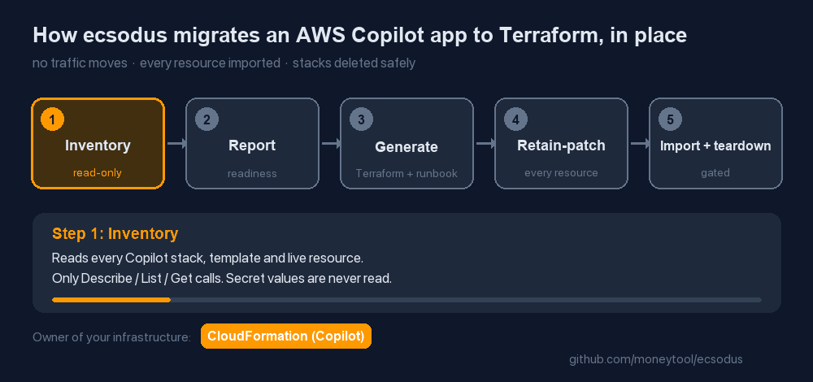
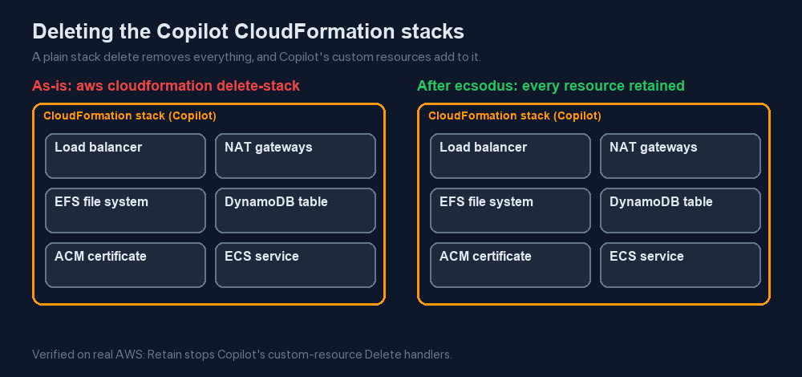

# Migrate AWS Copilot CLI apps to Terraform, in place

**ecsodus** migrates applications deployed with the **AWS Copilot CLI** to **Terraform-managed
Amazon ECS**, without moving traffic and without losing data. It is free and open source
(Apache-2.0).

```bash
pipx install ecsodus      # or: uvx ecsodus --help
brew install moneytool/tap/ecsodus
```



## Why you need more than "terraform import"

AWS ended support for the Copilot CLI on **2026-06-12**, and archived the
[aws/copilot-cli](https://github.com/aws/copilot-cli) repository on 2026-06-22. Your services
keep running as CloudFormation stacks. To move them to Terraform you have to delete those stacks
without deleting what they manage. Done naively, that destroys production:

- **Custom resources delete things.** When their stack is deleted, Copilot's Lambda-backed custom
  resources delete ACM certificates, DNS alias and validation records, and NS delegations, and
  they empty the access-logs bucket. See [what each Delete handler does](knowledge/copilot-custom-resources.md).
- **Deleting the last service stack removes shared infrastructure.** The env-controller then
  deletes the shared **load balancer**, the **NAT gateways** and the **EFS file system** from the
  environment stack.
- **Addon data has no protection.** Addon databases and tables have no `DeletionPolicy`, so they
  are deleted along with the service stack.
- **`--retain-resources` doesn't help.** It only works on stacks already in `DELETE_FAILED`.



## What ecsodus does

1. **Inventories** your Copilot app, read-only.
2. **Generates Terraform** with `import` blocks whose values are exactly what is deployed, so the
   first plan imports and changes nothing.
3. **Writes retain patches.** They add `DeletionPolicy: Retain` to every resource in every stack,
   so deleting a stack can no longer delete anything or invoke a Delete handler.
4. **Writes a runbook** in which every mutating step is gated by a machine check.


This was verified on real AWS: a live Copilot app was migrated with 44/44 pure imports. All its
Copilot stacks were deleted, the service kept serving, and the data survived
([report](e2e/2026-09-30-aws-e2e.md)).

[Read the migration guide](migrate-copilot-to-terraform.md){ .md-button .md-button--primary }
[AWS Copilot end of support: your options](copilot-end-of-support.md){ .md-button }

!!! note "Not GitHub Copilot"
    This project is about the **AWS Copilot CLI** (`copilot app/env/svc deploy`), Amazon's
    command-line tool for containerized apps on ECS and App Runner. It has nothing to do with
    GitHub Copilot.
